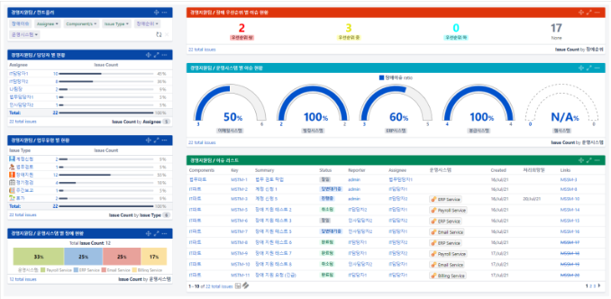

# 2주차-프로젝트주제 : 프로젝트 솔루션

- 일정 관리
    - 칸반보드 카드 등록으로 일정등록
    - 등록된 일정은 캘린더에 표시(fullcalendar api)
- 칸반보드
    - 알람 기능
    - 코드리뷰/수정 기능
    - 코드(업무)별 현재 상태 표시 (진행중, 대기중, 완료)
- 대시보드
    - 프로젝트별로 보이게
    - 그래프(Chart.js)
- 실시간 채팅
- 회원 정보 관리
    - 직책(팀장(PM), PL, 팀원 …)
    - 담당 프로젝트(여러개일 수 있다)
- 프로젝트별 구분
- (UI 커스터마이징 기능… React를 쓰면 가능할것 같긴 한데)

